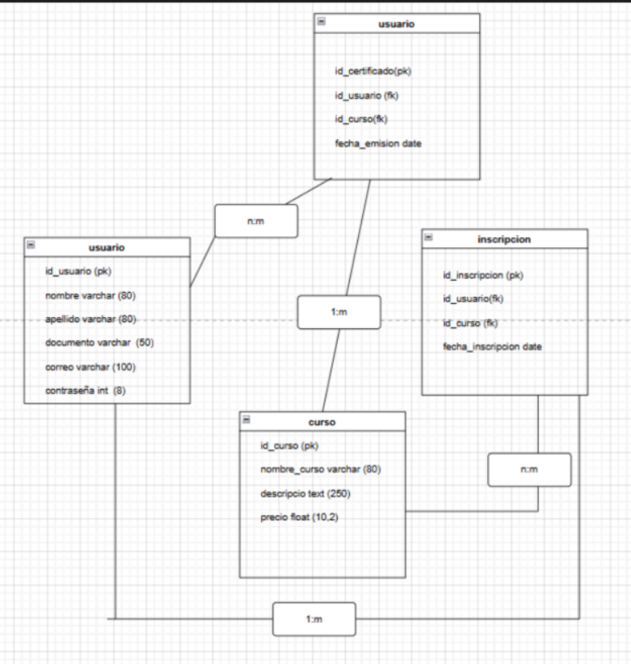

# knowly

knowly es una plataforma donde las personas pueden aprender a su ritmo de forma virtual.

## Introducción / Contexto

- **Descripción del problema que se busca resolver**  
En la actualidad, muchas personas desean aprender de manera independiente y flexible, mientras que profesores y expertos buscan compartir sus conocimientos y generar ingresos adicionales. Sin embargo, las plataformas existentes suelen ser costosas, carecen de material de estudio suficiente o no ofrecen certificados confiables. Esto limita el acceso a la educación virtual de calidad y dificulta la credibilidad del aprendizaje adquirido.

- **Justificación: ¿por qué es relevante?**  
El proyecto es relevante porque permite desarrollar una plataforma local que funcione siempre que haya conexión a internet, facilitando el acceso a cursos desde cualquier lugar y en cualquier momento. Los estudiantes pueden avanzar de forma independiente, mientras que los profesores obtienen ingresos y comparten su experiencia. Esto genera impacto social, académico y económico al democratizar el acceso al aprendizaje digital.

- **Breve descripción del dominio / temática del proyecto integrador**  
El proyecto se centra en crear una plataforma donde la monetización directa y el aprendizaje independiente sean el eje principal. Los usuarios pagan una suscripción para acceder a contenido exclusivo, cada curso ofrece certificado, existen foros, comentarios y un chat con el profesor visible para todos los estudiantes. Además, los usuarios pueden subir actividades, presentar exámenes y recibir retroalimentación.

## Objetivos

**Objetivo General**  
Diseñar y desarrollar una plataforma digital que permita la creación, gestión y monetización de cursos en línea, ofreciendo herramientas intuitivas para organizar contenidos, facilitar la interacción entre estudiantes y profesores, y garantizar una experiencia de aprendizaje accesible, certificada y flexible.

**Objetivos Específicos**

- **OE1** – Implementar un sistema que clasifique los cursos en categorías (cortos, medianos y largos) para facilitar la búsqueda según el tiempo disponible del usuario.
- **OE2** – Incorporar calificaciones y comentarios de los estudiantes para cada curso y profesor, garantizando transparencia y confianza en la calidad del contenido.
- **OE3** – Implementar un LMS que permita reproducir contenidos multimedia y realizar seguimiento automatizado del progreso académico del estudiante.
- **OE4** – Crear una interfaz intuitiva y responsiva que facilite la navegación, permitiendo que la compra e inicio de un curso se realicen de manera fluida.
- **OE5** – Desarrollar un módulo de pagos que permita a los profesores publicar contenidos mediante una tarifa de suscripción o derecho de piso dentro de la plataforma.

## Alcance del Proyecto (Scope)

**Qué se va a desarrollar:**

1. **Módulo de Gestión de Cuentas y Perfiles**  
   • Personalización de nombre, foto de perfil y ubicación.  
   • Restablecimiento de contraseñas, cambio de correo y cierre de sesión en todos los dispositivos.  
   • Configuración de notificaciones y disponibilidad en el chat.

2. **Módulo de Interacción y Comunidad**  
   • Sistema de mensajería interna (chat) con opción de bloquear usuarios.  
   • Herramientas de moderación y reportes.  
   • Acceso a reglas de convivencia y soporte técnico.

3. **Módulo de Gamificación y Participación**  
   • Sistema de puntos y niveles.  
   • Visualización de actividad diaria del usuario.

4. **Módulo de Gestión de Contenidos y Eventos**  
   • Control de acceso a cursos y eventos según permisos o progreso.

5. **Módulo de Pagos y Suscripciones**  
   • Gestión de membresías: cambio de plan, cancelación y historial de pagos.  
   • Pasarela de pagos y métodos de pago.  
   • Monetización mediante cuentas bancarias y sistema de referidos.

**Qué NO se va a desarrollar en esta versión (fuera de alcance):**

- Integración con API de Gemini para evaluación automática mediante IA.  
- Evaluación didáctica personalizada por IA (el examen final es el único medio para obtener certificado).  
- Traducción automática de videos o cambio de idioma (solo subtítulos disponibles).

## Tecnologías y Herramientas (Tech Stack)

- **Frontend**: Streamlit  
- **Backend**: Python  
- **Base de datos**: PostgreSQL  
- **Otras herramientas**: Git, GitHub, Docker, Postman, Swagger

## Integrantes del Equipo

| Nombre                 | Rol principal             | Usuario GitHub        |
|------------------------|---------------------------|------------------------|
| Johan Cadavid          | Líder / Backend           | @johanc178             |
| Sebastian Herrera      | Frontend Lead             | @Sebasherrera01        |
| Sharon Asprilla        | Backend / Base de datos   | @sharon-asprilla       |
| Juan Jose Castrillon   | Frontend / Creativo       | @Juanjo0828            |
| Jeronimo Taborda       | Backend                   | @JeritoX10             |

## Diagrama de Clases del Dominio (v1)

  
*Diagrama inicial del modelo de dominio – versión 1. Se actualizará en futuras entregas.*
